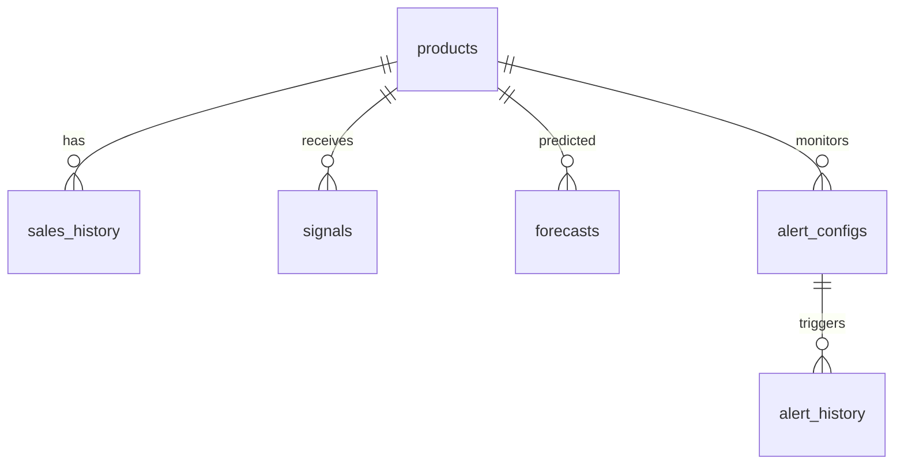

# PulseFlow — Complete Implementation Plan

> Context-Aware Dynamic Demand Forecasting Engine for Smart Production Planning

This document is your engineering onboarding guide. It covers every decision, every file, every command, and every architectural pattern needed to build PulseFlow from scratch — to a quality that impresses hiring teams at Google/Microsoft-caliber companies.

---

## 1. Tech Stack Decision

| Layer | Technology | Version | Why This Choice |
|---|---|---|---|
| **Frontend** | React 18 + Vite | `react@18`, `vite@6` | Industry standard, fast HMR, clean DX. Vite over CRA shows modern tooling awareness |
| **Charting** | Recharts | `recharts@2` | Composable React charting, great for time-series with confidence bands |
| **Styling** | Tailwind CSS 4 | `tailwindcss@4` | Rapid prototyping, consistent design system, beloved by product companies |
| **State Mgmt** | Zustand | `zustand@5` | Lightweight, no boilerplate. Shows you know when NOT to use Redux |
| **Backend** | FastAPI (Python) | `fastapi@0.115+` | Async, auto-docs (Swagger), type-safe. Pythonic ML integration |
| **ORM** | SQLAlchemy 2.0 | `sqlalchemy@2` | Industry-standard Python ORM, async support |
| **Database** | PostgreSQL 16 | `pg@16` | Production-grade RDBMS, time-series friendly with proper indexing |
| **ML — Time Series** | Facebook Prophet | `prophet@1.1` | Handles seasonality + holidays out of the box |
| **ML — Signal Boost** | XGBoost | `xgboost@2` | Best-in-class gradient boosting for tabular signal adjustment |
| **Task Queue** | Celery + Redis | `celery@5`, `redis@5` | Async model retraining, background signal ingestion |
| **Containerization** | Docker + Compose | `docker@27` | One-command dev setup, shows production-readiness |
| **CI/CD** | GitHub Actions | — | Industry default, free for public repos |
| **Deployment** | Railway / Render | — | Free tier, one-click deploy, great for portfolio |

> [!TIP]
> This stack is deliberately chosen to be **resume-optimized**: FastAPI + React + PostgreSQL + ML pipeline is the exact stack many product companies use internally.

---

## 2. Project Structure — Monorepo

**Why monorepo?** Single repo = single PR review, unified CI, easier for portfolio visitors to clone and run. We use a **clean layered architecture** on the backend and **feature-based structure** on the frontend.

```
pulseflow/
├── .github/
│   └── workflows/
│       ├── ci.yml                    # Lint + test on every PR
│       └── deploy.yml                # Deploy on merge to main
├── docker-compose.yml                # One-command full stack
├── docker-compose.dev.yml            # Dev overrides (hot reload)
├── .env.example                      # Environment variable template
├── README.md                         # Project overview + setup guide
│
├── backend/
│   ├── Dockerfile
│   ├── pyproject.toml                # Dependencies (Poetry/uv)
│   ├── alembic.ini                   # DB migration config
│   ├── alembic/
│   │   └── versions/                 # Migration files
│   ├── app/
│   │   ├── __init__.py
│   │   ├── main.py                   # FastAPI app entry point
│   │   ├── config.py                 # Settings via pydantic-settings
│   │   ├── dependencies.py           # Dependency injection
│   │   │
│   │   ├── models/                   # SQLAlchemy ORM models
│   │   │   ├── __init__.py
│   │   │   ├── product.py
│   │   │   ├── sales.py
│   │   │   ├── forecast.py
│   │   │   ├── signal.py
│   │   │   └── alert.py
│   │   │
│   │   ├── schemas/                  # Pydantic request/response schemas
│   │   │   ├── __init__.py
│   │   │   ├── product.py
│   │   │   ├── forecast.py
│   │   │   ├── signal.py
│   │   │   └── alert.py
│   │   │
│   │   ├── api/                      # Route handlers (thin controllers)
│   │   │   ├── __init__.py
│   │   │   ├── router.py             # Master router
│   │   │   ├── products.py
│   │   │   ├── forecasts.py
│   │   │   ├── signals.py
│   │   │   ├── alerts.py
│   │   │   └── health.py
│   │   │
│   │   ├── services/                 # Business logic layer
│   │   │   ├── __init__.py
│   │   │   ├── forecast_service.py   # Orchestrates ML pipeline
│   │   │   ├── signal_service.py     # External signal ingestion
│   │   │   ├── alert_service.py      # Threshold monitoring
│   │   │   └── explanation_service.py # NL explanation generator
│   │   │
│   │   ├── ml/                       # Machine learning pipeline
│   │   │   ├── __init__.py
│   │   │   ├── pipeline.py           # Orchestrator: Prophet → XGBoost
│   │   │   ├── prophet_model.py      # Time-series base model
│   │   │   ├── xgboost_model.py      # Signal adjustment model
│   │   │   ├── feature_engine.py     # Feature engineering
│   │   │   ├── data_generator.py     # Synthetic data generator
│   │   │   └── model_registry.py     # Model versioning & loading
│   │   │
│   │   ├── ingestion/                # External signal collectors
│   │   │   ├── __init__.py
│   │   │   ├── base.py               # Abstract signal collector
│   │   │   ├── news_collector.py     # NewsAPI integration
│   │   │   ├── social_collector.py   # Twitter/X trend signals
│   │   │   ├── weather_collector.py  # OpenWeatherMap integration
│   │   │   └── supplier_collector.py # Supplier lead-time mock
│   │   │
│   │   ├── tasks/                    # Celery async tasks
│   │   │   ├── __init__.py
│   │   │   ├── celery_app.py
│   │   │   ├── forecast_tasks.py     # Scheduled reforecasting
│   │   │   └── ingestion_tasks.py    # Periodic signal pulls
│   │   │
│   │   └── db/
│   │       ├── __init__.py
│   │       ├── session.py            # Async session factory
│   │       └── seed.py               # Seed data for demo
│   │
│   └── tests/
│       ├── conftest.py
│       ├── test_forecast_service.py
│       ├── test_ml_pipeline.py
│       ├── test_api_forecasts.py
│       └── test_signal_ingestion.py
│
├── frontend/
│   ├── Dockerfile
│   ├── package.json
│   ├── vite.config.js
│   ├── index.html
│   ├── public/
│   │   └── favicon.svg
│   ├── src/
│   │   ├── main.jsx                  # App entry point
│   │   ├── App.jsx                   # Router + layout
│   │   ├── index.css                 # Global styles + Tailwind
│   │   │
│   │   ├── api/                      # API client layer
│   │   │   ├── client.js             # Axios instance + interceptors
│   │   │   ├── forecasts.js          # Forecast API calls
│   │   │   ├── products.js           # Product API calls
│   │   │   └── signals.js            # Signal API calls
│   │   │
│   │   ├── stores/                   # Zustand state stores
│   │   │   ├── useForecastStore.js
│   │   │   ├── useProductStore.js
│   │   │   └── useAlertStore.js
│   │   │
│   │   ├── pages/                    # Route-level pages
│   │   │   ├── Dashboard.jsx         # Main forecasting view
│   │   │   ├── ProductDetail.jsx     # Per-product deep dive
│   │   │   ├── Signals.jsx           # Signal health monitor
│   │   │   └── Settings.jsx          # Alert thresholds config
│   │   │
│   │   ├── components/               # Reusable UI components
│   │   │   ├── layout/
│   │   │   │   ├── Sidebar.jsx
│   │   │   │   ├── Header.jsx
│   │   │   │   └── PageShell.jsx
│   │   │   ├── charts/
│   │   │   │   ├── ForecastChart.jsx         # Main time-series + confidence band
│   │   │   │   ├── SignalContribution.jsx    # Stacked bar: signal impact
│   │   │   │   └── AccuracyGauge.jsx         # Radial accuracy meter
│   │   │   ├── cards/
│   │   │   │   ├── ForecastSummaryCard.jsx   # KPI summary
│   │   │   │   ├── ExplanationCard.jsx       # "Why did forecast change?"
│   │   │   │   └── AlertCard.jsx             # Threshold breach alert
│   │   │   ├── controls/
│   │   │   │   ├── HorizonSelector.jsx       # 2/4/8 week toggle
│   │   │   │   ├── ProductPicker.jsx         # Product dropdown
│   │   │   │   └── OverrideSlider.jsx        # Manual override + sim
│   │   │   └── shared/
│   │   │       ├── LoadingSpinner.jsx
│   │   │       ├── EmptyState.jsx
│   │   │       └── Tooltip.jsx
│   │   │
│   │   ├── hooks/                    # Custom React hooks
│   │   │   ├── useForecast.js
│   │   │   └── useSignalHealth.js
│   │   │
│   │   └── utils/
│   │       ├── formatters.js         # Number/date formatting
│   │       └── constants.js          # API base URL, theme tokens
│   │
│   └── tests/
│       └── components/
│           └── ForecastChart.test.jsx
│
├── ml/                               # Standalone ML experimentation
│   ├── notebooks/
│   │   ├── 01_data_exploration.ipynb
│   │   ├── 02_prophet_baseline.ipynb
│   │   └── 03_xgboost_tuning.ipynb
│   ├── data/
│   │   ├── raw/                      # Raw CSV datasets
│   │   └── processed/                # Feature-engineered data
│   └── models/                       # Serialized model artifacts
│       └── .gitkeep
│
└── scripts/
    ├── seed_db.py                    # Populate DB with demo data
    ├── generate_synthetic_data.py    # Create realistic sales data
    └── train_models.py               # One-shot model training script
```

---

## 3. Step-by-Step Implementation Phases

### Phase 0 — Project Scaffolding (Day 1, ~2 hours)

**Goal:** Repo initialized, Docker running, both servers hot-reloading.

```bash
# Create project root
mkdir pulseflow && cd pulseflow
git init

# Backend setup
mkdir -p backend/app
cd backend
# Using uv (fast Python package manager — shows modern tooling)
pip install uv
uv init --name pulseflow-backend
uv add fastapi uvicorn[standard] sqlalchemy[asyncio] asyncpg alembic \
      pydantic-settings python-dotenv celery redis

# Frontend setup
cd ../
npm create vite@latest frontend -- --template react
cd frontend
npm install
npm install recharts zustand axios react-router-dom
npm install -D tailwindcss @tailwindcss/vite
cd ..

# Docker Compose
# Create docker-compose.yml (see below)
docker compose up -d db redis
```

**docker-compose.yml** (key services):

```yaml
services:
  db:
    image: postgres:16-alpine
    environment:
      POSTGRES_DB: pulseflow
      POSTGRES_USER: pulseflow
      POSTGRES_PASSWORD: pulseflow_dev
    ports:
      - "5432:5432"
    volumes:
      - pgdata:/var/lib/postgresql/data

  redis:
    image: redis:7-alpine
    ports:
      - "6379:6379"

  backend:
    build: ./backend
    command: uvicorn app.main:app --host 0.0.0.0 --port 8000 --reload
    ports:
      - "8000:8000"
    environment:
      DATABASE_URL: postgresql+asyncpg://pulseflow:pulseflow_dev@db:5432/pulseflow
      REDIS_URL: redis://redis:6379/0
    depends_on:
      - db
      - redis
    volumes:
      - ./backend:/app

  frontend:
    build: ./frontend
    command: npm run dev -- --host 0.0.0.0
    ports:
      - "5173:5173"
    volumes:
      - ./frontend:/app
      - /app/node_modules

volumes:
  pgdata:
```

**Output:** `http://localhost:8000/docs` shows Swagger UI, `http://localhost:5173` shows Vite splash.

---

### Phase 1 — Database & Core Models (Day 1–2, ~4 hours)

**Goal:** Schema migrated, seed data loaded, basic CRUD working.

**Files to create:** `app/models/*.py`, `app/schemas/*.py`, `app/db/session.py`, `app/db/seed.py`

```bash
cd backend
alembic init alembic
# Edit alembic/env.py to use async engine
alembic revision --autogenerate -m "initial_schema"
alembic upgrade head
python -m app.db.seed   # Load demo data
```

**Output:** `psql` shows populated tables; `/api/v1/products` returns JSON.

---

### Phase 2 — ML Pipeline (Day 2–3, ~6 hours)

**Goal:** Prophet baseline + XGBoost adjustment producing forecasts with confidence intervals.

**Files to create:** `app/ml/*.py`, `scripts/generate_synthetic_data.py`, `scripts/train_models.py`

**Steps:**
1. Generate 2 years of synthetic daily sales data (with seasonality, trend, noise) using `generate_synthetic_data.py`
2. Train Prophet on historical sales → produces `yhat`, `yhat_lower`, `yhat_upper`
3. Engineer external signal features (sentiment score, weather index, lead-time ratio, news event flag)
4. Train XGBoost on residuals (actual − Prophet prediction) using signal features
5. Final forecast = Prophet base + XGBoost adjustment

```bash
uv add prophet xgboost scikit-learn pandas numpy joblib
python scripts/generate_synthetic_data.py   # → ml/data/raw/sales.csv
python scripts/train_models.py               # → ml/models/prophet_v1.json, xgb_v1.joblib
```

**Output:** Serialized models in `ml/models/`, validation MAPE printed to console.

---

### Phase 3 — Signal Ingestion Layer (Day 3–4, ~4 hours)

**Goal:** External signals flowing into DB, ready for ML consumption.

**Files to create:** `app/ingestion/*.py`, `app/tasks/*.py`

**Pattern:** Abstract `BaseCollector` class with `.collect()` → each source implements it. Celery tasks call collectors on schedule.

```python
# app/ingestion/base.py — the pattern to follow
from abc import ABC, abstractmethod
from datetime import datetime

class BaseCollector(ABC):
    """All signal collectors implement this interface."""

    @abstractmethod
    async def collect(self, product_id: int, date: datetime) -> dict:
        """Return a dict of signal features for the given product/date."""
        ...

    @abstractmethod
    def source_name(self) -> str:
        """Return the human-readable signal source name."""
        ...
```

> [!IMPORTANT]
> For the hackathon prototype, **mock the external APIs** with realistic synthetic data. This avoids API rate limits and makes the demo reproducible. Each collector should have a `use_mock: bool` flag that defaults to `True`.

**Output:** `GET /api/v1/signals/{product_id}` returns latest signals from all sources.

---

### Phase 4 — Forecast API & Explanation Engine (Day 4–5, ~5 hours)

**Goal:** End-to-end forecast generation via API, with plain-English explanations.

**Files to create:** `app/services/forecast_service.py`, `app/services/explanation_service.py`, `app/api/forecasts.py`

**Explanation engine approach:**
- Compare XGBoost feature importances for the specific prediction
- Map top-3 contributing features to human-readable templates
- Example: `"Forecast revised upward 12% — driven by: (1) +18% social media mention spike, (2) regional festival in 5 days, (3) supplier lead time stable."`

**Output:** `POST /api/v1/forecasts/generate` returns forecast + explanation JSON.

---

### Phase 5 — React Dashboard (Day 5–7, ~8 hours)

**Goal:** Fully interactive dashboard with all Pillar 3 features.

**Build order:**
1. `PageShell` + `Sidebar` + `Header` → layout skeleton
2. `ForecastChart` → Recharts `ComposedChart` with `Area` (confidence band) + `Line` (forecast) + `Line` (actual)
3. `ExplanationCard` → renders the "why" explanation with signal icons
4. `HorizonSelector` → toggles 2/4/8 week view, re-fetches data
5. `ForecastSummaryCard` → KPI tiles (accuracy %, demand units, deviation %)
6. `SignalContribution` → stacked bar chart of signal impacts
7. `AccuracyGauge` → radial gauge showing model accuracy
8. `OverrideSlider` → manual override with downstream impact simulation
9. `AlertCard` → threshold breach notifications

```bash
# Additional frontend deps
cd frontend
npm install @heroicons/react clsx framer-motion
```

**Output:** Fully functional dashboard at `http://localhost:5173`.

---

### Phase 6 — Polish, Testing & Deployment (Day 7–8, ~4 hours)

**Goal:** Tests passing, CI green, deployed and shareable.

**Files to create:** `tests/*.py`, `.github/workflows/ci.yml`, `README.md`

```bash
# Backend tests
cd backend
uv add --dev pytest pytest-asyncio httpx
pytest tests/ -v

# Frontend tests
cd frontend
npm install -D vitest @testing-library/react @testing-library/jest-dom jsdom
npx vitest run
```

---

## 4. Database Schema

```sql
-- Core product catalog
CREATE TABLE products (
    id            SERIAL PRIMARY KEY,
    sku           VARCHAR(50) UNIQUE NOT NULL,
    name          VARCHAR(255) NOT NULL,
    category      VARCHAR(100),
    unit          VARCHAR(20) DEFAULT 'units',
    created_at    TIMESTAMPTZ DEFAULT NOW()
);
CREATE INDEX idx_products_category ON products(category);

-- Historical sales (the training data)
CREATE TABLE sales_history (
    id            SERIAL PRIMARY KEY,
    product_id    INTEGER REFERENCES products(id) ON DELETE CASCADE,
    date          DATE NOT NULL,
    quantity      INTEGER NOT NULL,
    revenue       DECIMAL(12,2),
    channel       VARCHAR(50),  -- 'online', 'retail', 'wholesale'
    created_at    TIMESTAMPTZ DEFAULT NOW(),
    UNIQUE(product_id, date, channel)
);
CREATE INDEX idx_sales_product_date ON sales_history(product_id, date DESC);

-- External signals (ingested from APIs)
CREATE TABLE signals (
    id              SERIAL PRIMARY KEY,
    product_id      INTEGER REFERENCES products(id) ON DELETE CASCADE,
    date            DATE NOT NULL,
    source          VARCHAR(50) NOT NULL,  -- 'social', 'weather', 'news', 'supplier'
    signal_name     VARCHAR(100) NOT NULL,
    signal_value    FLOAT NOT NULL,
    raw_payload     JSONB,                 -- Original API response for auditability
    collected_at    TIMESTAMPTZ DEFAULT NOW(),
    UNIQUE(product_id, date, source, signal_name)
);
CREATE INDEX idx_signals_product_date ON signals(product_id, date DESC);
CREATE INDEX idx_signals_source ON signals(source);

-- Generated forecasts
CREATE TABLE forecasts (
    id              SERIAL PRIMARY KEY,
    product_id      INTEGER REFERENCES products(id) ON DELETE CASCADE,
    forecast_date   DATE NOT NULL,           -- The date being predicted
    generated_at    TIMESTAMPTZ DEFAULT NOW(),-- When the forecast was made
    horizon_weeks   INTEGER NOT NULL,         -- 2, 4, or 8
    predicted_qty   FLOAT NOT NULL,
    lower_bound     FLOAT NOT NULL,           -- Confidence interval
    upper_bound     FLOAT NOT NULL,
    confidence      FLOAT,                    -- 0.0 – 1.0
    model_version   VARCHAR(50),
    explanation     TEXT,                     -- Plain-English explanation
    signal_contributions JSONB,              -- {"social": 0.18, "weather": -0.05, ...}
    is_override     BOOLEAN DEFAULT FALSE,
    override_qty    FLOAT,
    UNIQUE(product_id, forecast_date, horizon_weeks, generated_at)
);
CREATE INDEX idx_forecasts_product_date ON forecasts(product_id, forecast_date DESC);

-- Alert configuration & history
CREATE TABLE alert_configs (
    id              SERIAL PRIMARY KEY,
    product_id      INTEGER REFERENCES products(id) ON DELETE CASCADE,
    metric          VARCHAR(50) NOT NULL,     -- 'deviation_pct', 'stockout_risk'
    threshold       FLOAT NOT NULL,
    direction       VARCHAR(10) NOT NULL,     -- 'above', 'below'
    is_active       BOOLEAN DEFAULT TRUE
);

CREATE TABLE alert_history (
    id              SERIAL PRIMARY KEY,
    config_id       INTEGER REFERENCES alert_configs(id),
    product_id      INTEGER REFERENCES products(id),
    triggered_at    TIMESTAMPTZ DEFAULT NOW(),
    metric_value    FLOAT NOT NULL,
    message         TEXT NOT NULL,
    is_read         BOOLEAN DEFAULT FALSE
);

-- Model tracking (lightweight MLflow alternative)
CREATE TABLE model_registry (
    id              SERIAL PRIMARY KEY,
    model_name      VARCHAR(100) NOT NULL,    -- 'prophet_base', 'xgboost_signal'
    version         VARCHAR(50) NOT NULL,
    artifact_path   VARCHAR(500) NOT NULL,
    metrics         JSONB,                    -- {"mape": 0.12, "rmse": 450}
    is_active       BOOLEAN DEFAULT FALSE,
    trained_at      TIMESTAMPTZ DEFAULT NOW(),
    UNIQUE(model_name, version)
);
```

**Relationships:**



---

## 5. API Design

**Base URL:** `/api/v1`

### Products

| Method | Route | Description | Request Body | Response |
|---|---|---|---|---|
| `GET` | `/products` | List all products | — | `[{id, sku, name, category}]` |
| `GET` | `/products/{id}` | Get product detail | — | `{id, sku, name, category, latest_forecast}` |
| `POST` | `/products` | Create product | `{sku, name, category, unit}` | `{id, ...}` (201) |

### Forecasts

| Method | Route | Description | Request Body | Response |
|---|---|---|---|---|
| `POST` | `/forecasts/generate` | Generate forecast | `{product_id, horizon_weeks}` | `{forecast_id, predictions: [{date, qty, lower, upper}], explanation}` |
| `GET` | `/forecasts/{product_id}` | Get latest forecast | Query: `?horizon=2\|4\|8` | `{predictions[], explanation, signal_contributions, accuracy}` |
| `GET` | `/forecasts/{product_id}/history` | Forecast version history | Query: `?limit=10` | `[{generated_at, predicted_qty, actual_qty, accuracy}]` |
| `POST` | `/forecasts/{id}/override` | Manual override | `{override_qty}` | `{original_qty, override_qty, impact_simulation}` |

### Signals

| Method | Route | Description | Request Body | Response |
|---|---|---|---|---|
| `GET` | `/signals/{product_id}` | Get latest signals | Query: `?source=social` | `[{source, signal_name, signal_value, collected_at}]` |
| `POST` | `/signals/collect` | Trigger signal collection | `{product_id}` | `{status: "collecting", task_id}` |
| `GET` | `/signals/health` | Signal source health | — | `[{source, last_collected, status}]` |

### Alerts

| Method | Route | Description | Request Body | Response |
|---|---|---|---|---|
| `GET` | `/alerts` | Get active alerts | Query: `?unread=true` | `[{id, product_name, message, triggered_at}]` |
| `POST` | `/alerts/config` | Set alert threshold | `{product_id, metric, threshold, direction}` | `{config_id}` (201) |
| `PUT` | `/alerts/{id}/read` | Mark alert read | — | `204 No Content` |

### System

| Method | Route | Description |
|---|---|---|
| `GET` | `/health` | Health check + DB/Redis connectivity |
| `GET` | `/models/active` | Currently active model versions |

---

## 6. ML Pipeline

### Data Strategy

**For the prototype, we generate synthetic data** that mimics real manufacturing demand:

```python
# scripts/generate_synthetic_data.py — key logic
def generate_sales(product_id: int, days: int = 730) -> pd.DataFrame:
    """Generate 2 years of realistic daily sales with:
    - Base trend (slight upward)
    - Weekly seasonality (weekday > weekend)
    - Monthly seasonality (month-end spikes)
    - Annual seasonality (Q4 peak, Q1 dip)
    - Random noise
    - Occasional demand shocks (simulating viral events)
    """
    dates = pd.date_range(end=datetime.today(), periods=days, freq='D')
    base = 500  # base daily demand

    trend = np.linspace(0, 80, days)
    weekly = 50 * np.sin(2 * np.pi * np.arange(days) / 7)
    monthly = 30 * np.sin(2 * np.pi * np.arange(days) / 30)
    annual = 120 * np.sin(2 * np.pi * (np.arange(days) - 60) / 365)
    noise = np.random.normal(0, 40, days)

    # Inject 5-8 demand shocks
    shocks = np.zeros(days)
    for _ in range(np.random.randint(5, 9)):
        shock_day = np.random.randint(30, days - 30)
        shocks[shock_day:shock_day+7] += np.random.choice([-1, 1]) * np.random.uniform(100, 300)

    quantity = base + trend + weekly + monthly + annual + noise + shocks
    quantity = np.maximum(quantity, 0).astype(int)

    return pd.DataFrame({'date': dates, 'product_id': product_id, 'quantity': quantity})
```

### Training Pipeline

```
┌─────────────────┐     ┌──────────────┐     ┌──────────────────┐
│  sales_history   │────▶│   Prophet    │────▶│  Base Forecast   │
│  (2 yr daily)    │     │  (Layer 1)   │     │  yhat ± bounds   │
└─────────────────┘     └──────────────┘     └───────┬──────────┘
                                                      │
┌─────────────────┐     ┌──────────────┐              │
│  signals table   │────▶│  Feature     │     ┌───────▼──────────┐
│  (social, news,  │     │  Engineering │────▶│    XGBoost       │
│   weather, etc.) │     └──────────────┘     │   (Layer 2)      │
└─────────────────┘                           │  Adjusts residual│
                                              └───────┬──────────┘
                                                      │
                                              ┌───────▼──────────┐
                                              │  Final Forecast  │
                                              │  with confidence │
                                              │  + explanation   │
                                              └──────────────────┘
```

### Model Versioning

- Models serialized with `joblib` (XGBoost) and native JSON (Prophet)
- Each training run writes to `model_registry` table with metrics (MAPE, RMSE)
- `is_active` flag determines which version serves predictions
- Retraining triggered via Celery task on schedule or manual API call

### Retraining Strategy

- **Automated:** Weekly retrain via Celery beat schedule (every Sunday at 2 AM)
- **Manual:** `POST /api/v1/models/retrain` triggers immediate retrain
- **Drift detection:** If rolling 7-day MAPE exceeds 20%, auto-trigger retrain + alert

---

## 7. Dashboard Design

### Page Layout

The dashboard uses a **sidebar + main content** layout with a dark-mode-first design.

### Key Components & Data Mapping

| Component | Data Source | What It Shows |
|---|---|---|
| `ForecastChart` | `GET /forecasts/{id}` | Time-series line with shaded confidence band (Recharts `Area` + `Line`) |
| `ExplanationCard` | `forecast.explanation` + `signal_contributions` | Plain-English "why" card with signal icons and contribution bars |
| `ForecastSummaryCard` | Computed from forecast data | 4 KPI tiles: predicted demand, accuracy %, deviation from last week, confidence level |
| `HorizonSelector` | Controls `?horizon=` param | Segmented toggle: 2W / 4W / 8W — re-fetches forecast on change |
| `SignalContribution` | `forecast.signal_contributions` | Stacked horizontal bar: % contribution of each signal (social, weather, news, supplier) |
| `AccuracyGauge` | `forecast.accuracy` | Radial gauge (green >80%, yellow 60-80%, red <60%) |
| `OverrideSlider` | `POST /forecasts/{id}/override` | Slider to manually set quantity + instant impact simulation panel |
| `AlertCard` | `GET /alerts?unread=true` | Toast-style cards for threshold breaches with dismiss action |
| `Sidebar` | Static routes | Navigation: Dashboard, Products, Signals, Settings |

### State Management (Zustand)

```javascript
// stores/useForecastStore.js
export const useForecastStore = create((set, get) => ({
  // State
  selectedProductId: null,
  horizon: 4,
  forecast: null,
  isLoading: false,
  error: null,

  // Actions
  setProduct: (id) => set({ selectedProductId: id }),
  setHorizon: (weeks) => set({ horizon: weeks }),
  fetchForecast: async () => {
    const { selectedProductId, horizon } = get();
    set({ isLoading: true, error: null });
    try {
      const data = await forecastApi.getForecast(selectedProductId, horizon);
      set({ forecast: data, isLoading: false });
    } catch (err) {
      set({ error: err.message, isLoading: false });
    }
  },
}));
```

---

## 8. Deployment Plan

### Architecture

```
┌──────────────┐     ┌──────────────┐     ┌──────────────┐
│   Vercel /    │     │   Railway /  │     │   Railway     │
│   Netlify     │────▶│   Render     │────▶│   Postgres    │
│  (Frontend)   │     │  (Backend)   │     │   (Database)  │
└──────────────┘     └──────┬───────┘     └──────────────┘
                            │
                     ┌──────▼───────┐
                     │   Railway     │
                     │   Redis       │
                     │  (Task Queue) │
                     └──────────────┘
```

### Service-by-Service Plan

| Service | Platform | Tier | Notes |
|---|---|---|---|
| **Frontend** | Vercel | Free (Hobby) | Auto-deploy on push, global CDN |
| **Backend API** | Railway | Free ($5 trial credit) | Docker deploy, auto-restart |
| **PostgreSQL** | Railway or Neon | Free tier | Neon offers 0.5GB free, serverless |
| **Redis** | Railway or Upstash | Free tier | Upstash: 10K commands/day free |
| **ML Models** | Bundled with backend | — | Serialized models in container image |

### CI/CD — GitHub Actions

```yaml
# .github/workflows/ci.yml
name: CI
on: [push, pull_request]

jobs:
  backend:
    runs-on: ubuntu-latest
    services:
      postgres:
        image: postgres:16-alpine
        env:
          POSTGRES_DB: test_pulseflow
          POSTGRES_USER: test
          POSTGRES_PASSWORD: test
        ports: ["5432:5432"]
    steps:
      - uses: actions/checkout@v4
      - uses: actions/setup-python@v5
        with: { python-version: "3.12" }
      - run: pip install uv && uv sync
        working-directory: backend
      - run: uv run pytest tests/ -v --tb=short
        working-directory: backend

  frontend:
    runs-on: ubuntu-latest
    steps:
      - uses: actions/checkout@v4
      - uses: actions/setup-node@v4
        with: { node-version: "20" }
      - run: npm ci
        working-directory: frontend
      - run: npm run lint
        working-directory: frontend
      - run: npx vitest run
        working-directory: frontend
```

---

## 9. What Makes This Hireable

### Architectural Patterns That Signal Senior Thinking

| Pattern | Where | Why It Impresses |
|---|---|---|
| **Repository/Service/Controller layering** | `models/` → `services/` → `api/` | Clean separation of concerns — standard at Google, Microsoft |
| **Abstract base classes for extensibility** | `BaseCollector` in ingestion | Open/Closed principle — easy to add new signal sources |
| **Dependency injection** | FastAPI `Depends()` | Testable, decoupled — matches enterprise patterns |
| **Schema validation at boundaries** | Pydantic `schemas/` | Input/output contracts — critical for production APIs |
| **Feature-based frontend structure** | `pages/` + `components/` + `stores/` | Scalable React architecture — not spaghetti |
| **Model registry + versioning** | `model_registry` table | Shows ML engineering maturity, not just "data science" |

### Code Quality Practices

1. **Type everything** — Python type hints on every function, TypeScript would be even better (optional upgrade)
2. **Docstrings on public APIs** — Google-style docstrings on all service methods
3. **Meaningful commit messages** — `feat(ml): add XGBoost signal adjustment layer` (Conventional Commits)
4. **Pre-commit hooks** — `ruff` (Python linting), `eslint` + `prettier` (JS)
5. **Environment-based config** — Never hardcode secrets; use `pydantic-settings`
6. **Error handling middleware** — Global exception handler returning structured error JSON
7. **API versioning** — `/api/v1/` prefix from day one
8. **README that sells** — Architecture diagram, GIF of dashboard, one-command setup

### The "Wow Factor" Checklist

- [ ] **Animated confidence bands** on the forecast chart (Framer Motion)
- [ ] **Real-time signal pulse indicator** in the sidebar (shows signals are "alive")
- [ ] **Typing animation** on explanation cards (reveals the "why" progressively)
- [ ] **Dark + light mode toggle** with smooth transition
- [ ] **Keyboard shortcuts** (e.g., `1/2/3` for horizon, `N` for next product)
- [ ] **Export forecast as PDF** with branding

---

## Verification Plan

### Automated Tests

```bash
# Backend — run from project root
cd backend && uv run pytest tests/ -v --tb=short

# Frontend — run from project root
cd frontend && npx vitest run

# Full stack — Docker
docker compose up --build
# Then visit http://localhost:8000/docs for API health
# Then visit http://localhost:5173 for dashboard
```

### Manual Verification

1. **API Smoke Test:** Open `http://localhost:8000/docs`, execute `POST /api/v1/forecasts/generate` with a valid `product_id` — verify forecast + explanation returned
2. **Dashboard Visual Check:** Open `http://localhost:5173`, select a product, toggle horizon selector — verify chart updates with confidence bands
3. **Explanation Card:** Generate a new forecast, verify the "Why did the forecast change?" card shows top signal contributors
4. **Override Flow:** Use the override slider, verify impact simulation updates in real time
5. **Alert System:** Set a low threshold in Settings, generate a forecast that breaches it, verify alert appears

---

> [!NOTE]
> This plan is designed for a **1-week intensive build**. Each phase has clear deliverables. The phases are ordered so that you always have something demo-able at the end of each day. If time is short, Phase 5 (Dashboard) is where you spend the most polish time — it's what people see first.
